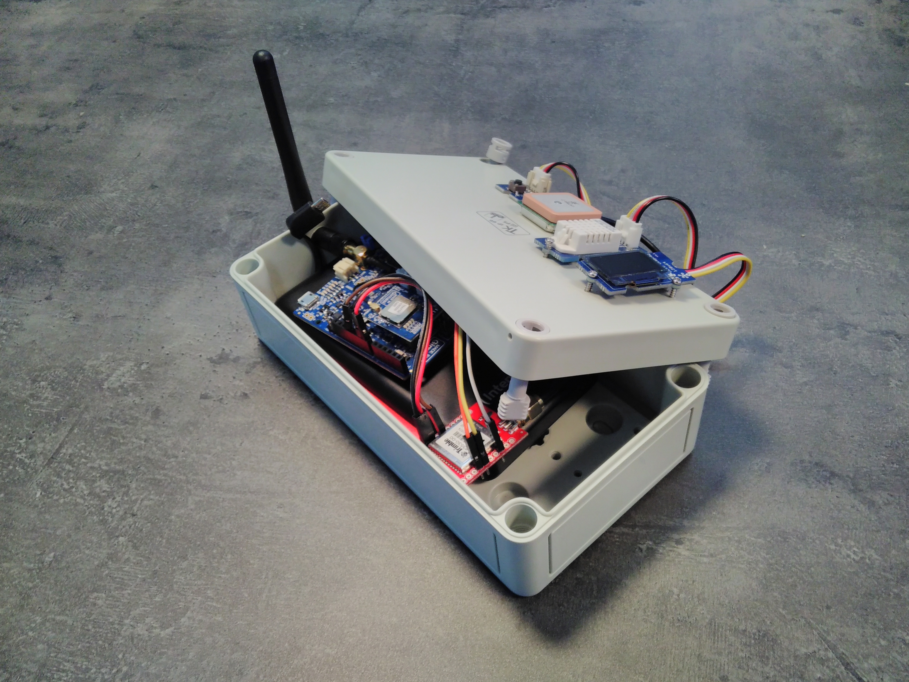
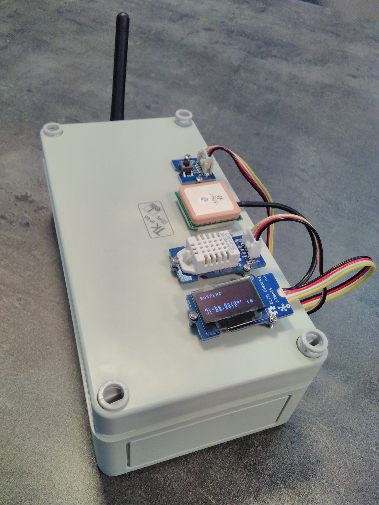
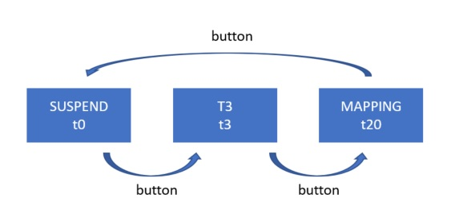
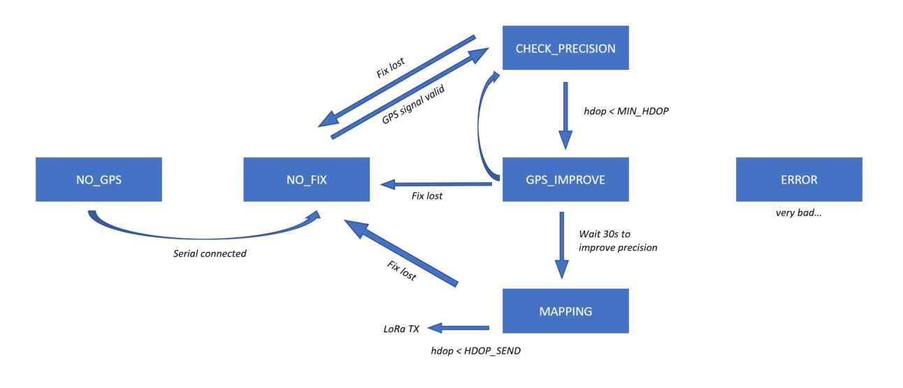
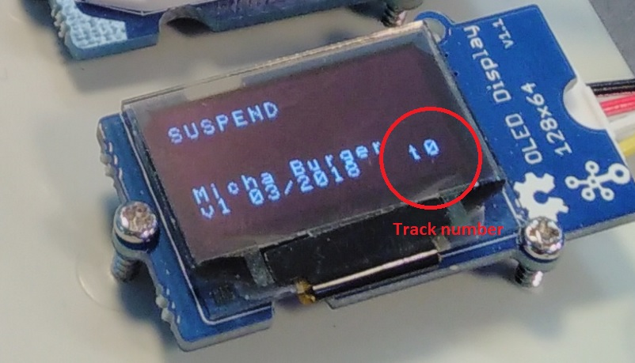

# Swisscom LPN Mapping device



This device is built on [Tuino 1](www.tuino.io) with [ST I-CUBE LRWAN](https://github.com/gimasi/GMX_LR1_AT_MODEM) and features the [Grove humidity and temperature sensor](http://wiki.seeed.cc/Grove-Temperature_and_Humidity_Sensor_Pro/) and a [Trimble GPS (Sparkfun Copernicus II DIP)](https://www.sparkfun.com/products/11858?_ga=2.245291909.129632425.1521044459-524054582.1519123891) on top of it. For the user interface, a [Grove OLED 0.96''](http://wiki.seeed.cc/Grove-OLED_Display_0.96inch/) and a [Grove button](http://wiki.seeed.cc/Grove-Button/) were added. 

## Hardware and connections
The hardware has to be connected as follows:
* (GPS) VCC → 3.3V
* (GPS) R2 → 3.3V
* (GPS) GND → GND
* (GPS) TX-B → RX (Disconnect before flushing the code)
* (GPS) RX-B → TX (Disconnect before flushing the code)  
More information about connecting the GPS can be found in the [Trimble Copernicus II Hookup guide](https://learn.sparkfun.com/tutorials/copernicus-ii-hookup-guide).
* [OLED](http://wiki.seeed.cc/Grove-OLED_Display_0.96inch/) on Grove I2C connector
* [HT sensor](http://wiki.seeed.cc/Grove-Temperature_and_Humidity_Sensor_Pro/) on Grove D5
* [Button](http://wiki.seeed.cc/Grove-Button/) on Grove D4  
  
The antenna, the sensors, UI components and optionally the GPS antenna have to be placed outside the box, which looks as follows:


## State machine and schematics

With the button, the user can switch between different tracking modes or suspend the tracking. This is particularily useful if you meet somebody on the campus and stop for a chat, then you don't want the same point to be mapped multiple times.


The schematics of this first, outer state machine is shown above. As the rest of the code still uses the delay() function, the button has to be pressed for several seconds in order to take the change into account. 


The inner state machine is described above. The following states can be taken:  
* NO_GPS: GPS not connected. Check RX/TX cables.
* NO_FIX: No valid GPS coordinates, there is no GPS reception.
* CHECK_PRECISION: GPS Fix is available, but only with few satellites and bad precision. In this state we wait for the HDOP to drop below 500.
* GPS_IMPROVE: Because in the first 30s after the GPS fix, the precision of the GPS is not optimal yet, we wait 30s in this state before starting the mapping.
* MAPPING: The GPS signal and the signal from the HT sensor is registered and sent with LoRaWAN in the pre-defined time interval.

##Track numbers
The track number is sent in the payload and stored together with the point in the server. It is later used to filter the points according to the experiment or store them in a different part of the database.
* Track 0: Mapping suspended (nothing sent)
* Track 1: ESP data collection (test, some values missing)
* Track 2: Static hum & temp measures
* Tracks 3-12: Static triangulation (10 different fixed points)
* Track 20: ESP data collection (latest version)
* Track 99: Test, to be discarded by the server  
  

The track number is displayed at the bottom right of the screen.

## Library modifications
Some libraries have been modified for this project:
  
In order to change the spreading factor with disabled ADR, those lines were added:

gmx_lr.h:

```
byte gmxLR_setSF(String sf);
```
gmx_lr.cpp:
```
//modified by Micha Burger 09.03.2018
byte gmxLR_setSF(String sf){
  
  _sendCmd( "AT+DR="+sf+"\r" );

  return(_parseResponse(dummyResponse));    

}
```
The following code adds the function to turn the OLED by 180°:
  
SeeedOLED.h:
```
void setRotation(bool Rotation);
```
  
SeeedOLED.cpp:
```
void SeeedOLED::setRotation(bool Rotation) // Rotation=true/false
{
   if (Rotation == true) {
      // Display rotation 180°
      sendCommand(0xA8); // mux ratio(3F=[64 lines])
      sendCommand(0x3F);
      sendCommand(0xA0); // segment remap(top / bottom reversed)
      sendCommand(0xC9);
      sendCommand(0xA0); // segment remap(left / right reversed)
      sendCommand(0xA1);
   }
   else {
      // Display rotation 0°
      sendCommand(0xA8); // mux ratio(3F=[64 lines])
      sendCommand(0x3F);
      sendCommand(0xA0); // segment remap(top / bottom normal)
      sendCommand(0xC0);
      sendCommand(0xA0); // segment remap(left / right normal)
      sendCommand(0xA0);
   }
   setTextXY(0,0);
}
```


## Server & Backend

This firmware is made to work together with the following server-based software:
* [Spaghetti](https://github.com/michaburger/spaghetti): Server script based on Python flask
* [Webmap](https://github.com/michaburger/webmap): Map (OSM) generator and data analysis tool built with python and folium (leaflet.js)


## Built on

* [Tuino 1](https://tuino.io) - IoT reference development platform based on Arduino


## Authors
* **Micha Burger** - EPFL - [Github](https://github.com/michaburger)